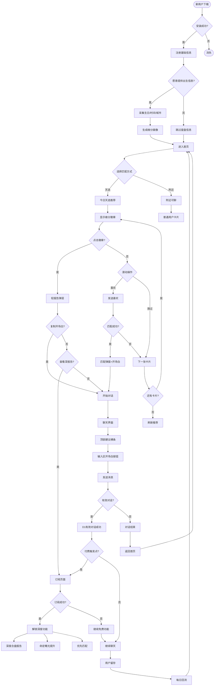
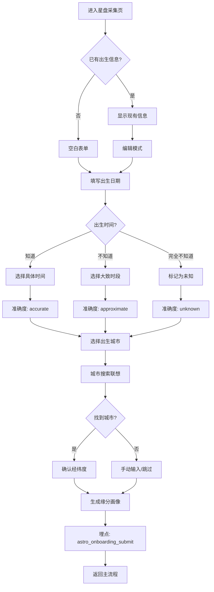
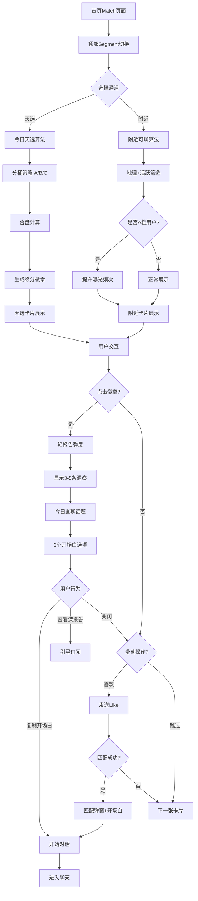
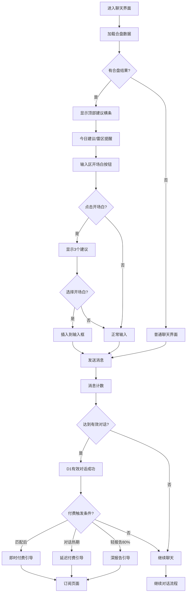
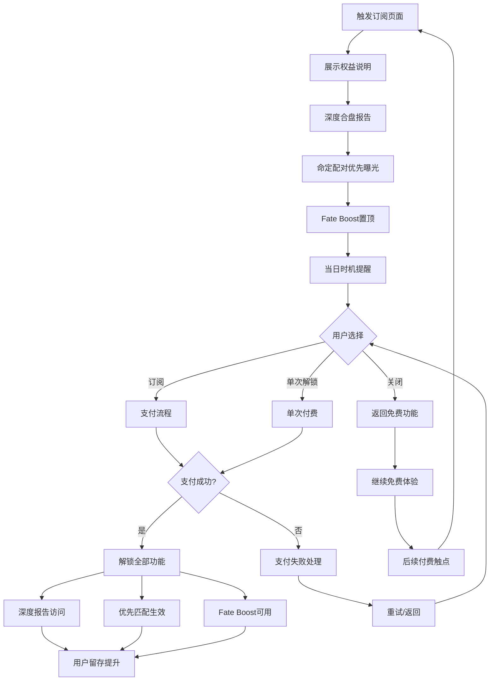
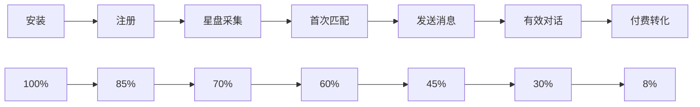

# 星盘合盘业务流程图 V1.0

## 用户旅程全景图

## 核心功能模块流程

### 1. 星盘信息采集流程

### 2. 双通道匹配流程

### 3. 聊天增强流程

### 4. 订阅与变现流程

## 关键指标监控

### 转化漏斗

### 核心指标
- **获取**: 注册完成率、星盘信息完成率
- **激活**: TTFM(首条消息时间)、D1有效对话率
- **互动**: 天选点击率、轻报告查看率、开场白使用率
- **变现**: 付费页面查看率、订阅转化率、ARPPU
- **留存**: D1/D7/D30留存率、星盘功能回访率

## 技术实现优先级

### P0 (核心体验)
1. 星盘信息采集页面
2. 双通道首页(天选/附近)
3. 缘分徽章 + 轻报告
4. 聊天开场白集成

### P1 (变现关键)
1. 深度报告订阅
2. 付费触发点优化
3. 命定曝光算法

### P2 (体验增强)
1. 每日运势推送
2. Fate Boost功能
3. 个人星盘页面

这个流程图涵盖了从用户获取到变现的完整链路，你觉得哪个环节需要进一步细化？
